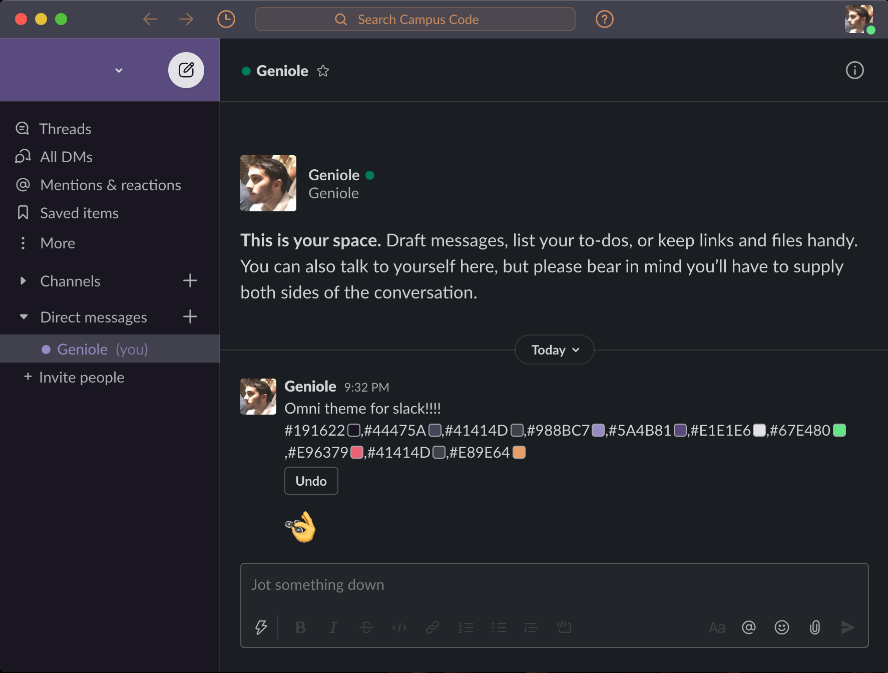
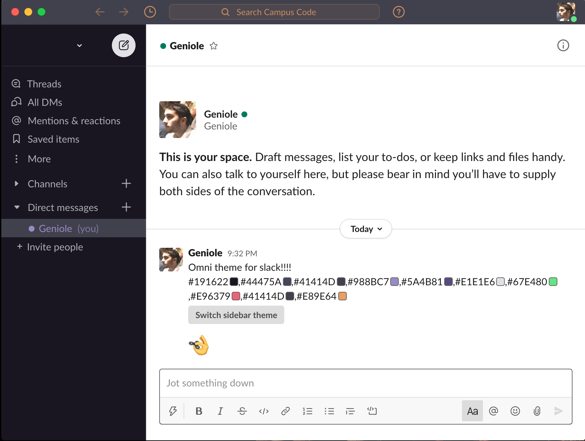

# Omni for [Slack](https://slack.com)

> 🎨 Omni is everywhere [Slack](https://slack.com)




## Installation Instructions

1.  Copy the text below:

```
#191622,#44475A,#41414D,#988BC7,#5A4B81,#E1E1E6,#67E480,#E96379,#41414D,#E89E64
```

2.  Paste and send it in any Conversation, and click on `"Switch sidebar theme"`:


